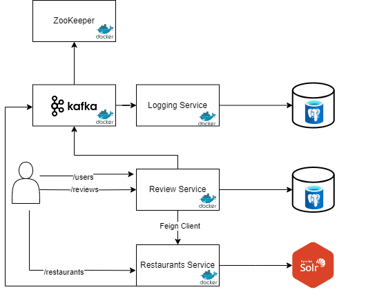

# n11 TalentHub Backend Bootcamp Final Project

This project aims to create a service containing user reviews for users and restaurants.

## Table of Contents
1. [Project Description](#project-description)
2. [Used Technologies](#used-technologies)
3. [Installation](#installation)
4. [Architecture and Class Overview](#architecture-and-class-overview)
    - [Review Service](#review-service)
    - [Restaurant Service](#restaurant-service)
    - [Logging Service](#logging-service)
5. [Usage](#usage)
6. [API Documentation](#api-documentation)
7. [Tests](#tests)
8. [Contributing](#contributing)
9. [License](#license)

## Project Description

This project aims to provide a platform where users can comment on restaurants and receive restaurant recommendations. The project meets the following basic requirements:

- User registration, update, and deletion operations.
- Restaurant registration, update, and deletion operations.
- Creation, update, and deletion of user comments.
- An API providing recommendations to users.

This project has a frontend part you can find [n11 TalentHub Backend Bootcamp Final Case Frontend](https://github.com/mehmetgencv/n11-TalentHub-Backend-Bootcamp-Final-Case-Frontend)


The project is developed using technologies such as Spring and Hibernate and can be accessed via RESTful APIs.
## Used Technologies

- Java 17
- Spring Boot 2.7.7
- Kafka
- Apache Solr
- Zookeeper
- PostgreSQL

## Installation


1. Copy the project files to your computer.
2. Update your database connection information in the `application.properties` file.
3. Install project dependencies using Maven by running the `mvn install` command.
4. Start the application by running the `mvn spring-boot:run` command.
5. Alternatively, you can use Docker Compose to run the services:

```bash
docker-compose up
```

This will start the following services in Docker:

- restaurant-service (port: 8080)
- review-service (port: 8081)
- logging-service (port: 8082)
- Kafka (port: 9092)
- Apache Solr (port: 8983)
- Zookeeper (port: 2181)
- PostgreSQL (port: 5432)

## Architecture and Class Overview



#### Review Service

`UserService`: Manages user-related operations such as registration, update, and deletion. Uses PostgreSQL for data storage.

`ReviewService`: Handles operations related to user comments such as creation, update, and deletion of reviews. Uses PostgreSQL for data storage.
- **Functionality**: Produces logs to Kafka for system activities and errors. 
- **Connected to Restaurant Service via Feign Client**: The Review Service communicates with the Restaurant Service using a Feign Client to access restaurant-related functionalities, such as retrieving restaurant information for reviews and recommendations.
- **Additional Features**:
    - Provides an API for recommending restaurants to users based on their location and restaurant ratings.
        - Considerations:
            - Restaurants within a 10 km radius should not be recommended.
            - Closer restaurants should be weighted higher based on their proximity.
            - Weight distribution: 70% for restaurant ratings and 30% for proximity ratings.
#### Restaurant Service

`RestaurantService`: Manages restaurant-related operations such as registration, update, and deletion. uses Apache Solr for search operations.
- **Functionality**: Produces logs to Kafka for system activities and errors.

### Logging Service

`LoggingService`: Consumes logs from Kafka and stores them in a PostgreSQL database.


## Usage

After successfully running the project, you can manage users, restaurants, and comments using the APIs. You can also use the provided API to receive recommendations.

## API Documentation

Swagger/OpenAPI is used to document the usage and parameters of the APIs. You can access the API documentation [here](http://localhost:8080/swagger-ui.html) (default port is 8080).

## Tests

Both unit tests and integration tests have been written for the project. You can run all tests using Maven by running the `mvn test` command.


## License

This project is licensed under the MIT License. For more information, you can review the [LICENSE](LICENSE) file.

<a href="https://www.n11.com/">
  
</a>

<a href="https://www.patika.dev/">
  
</a>